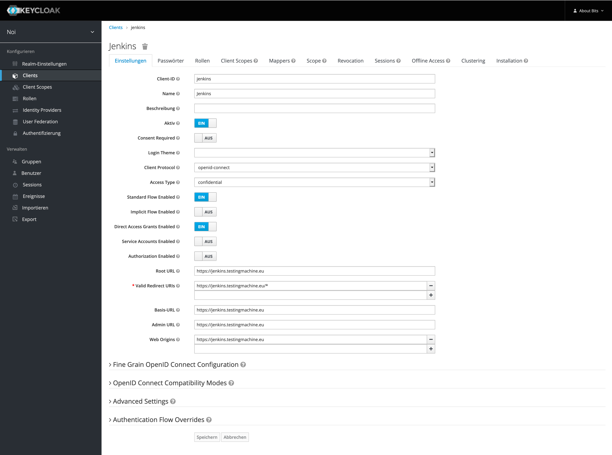
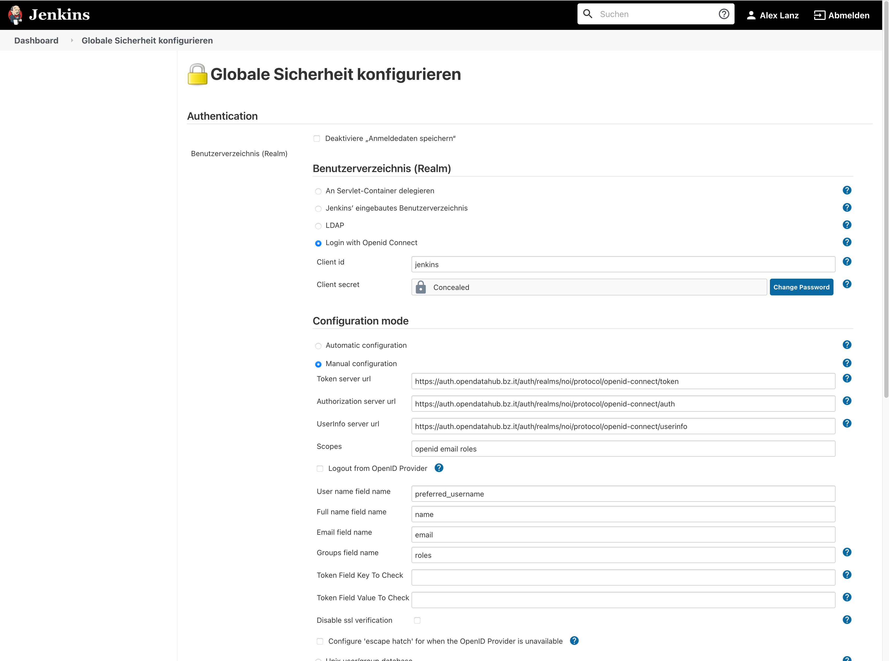
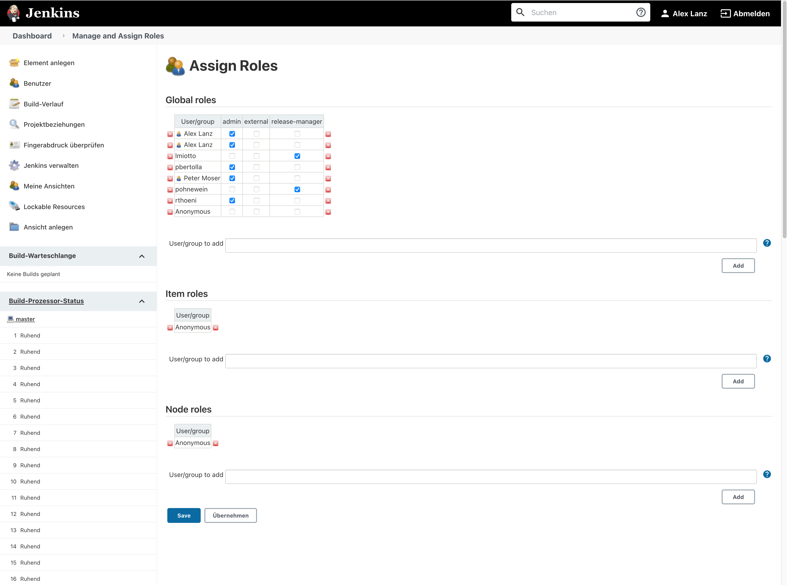
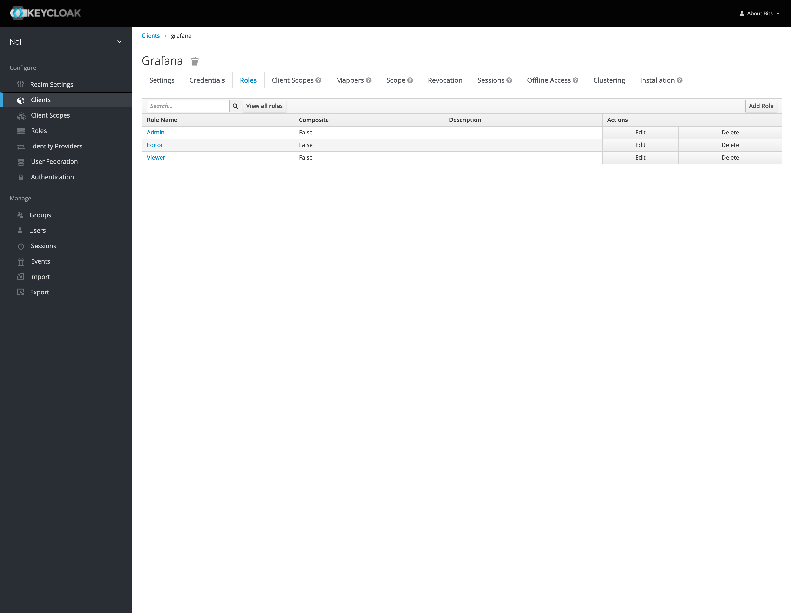
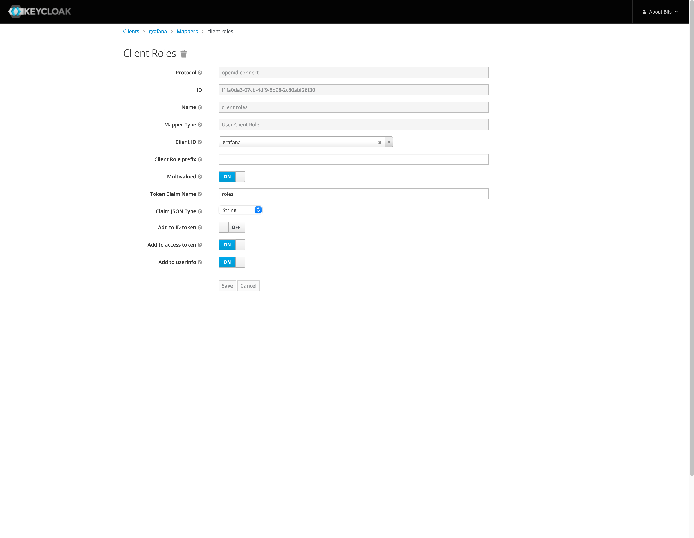
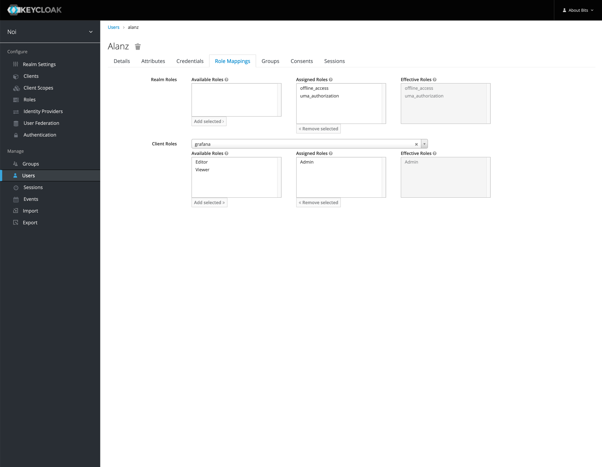
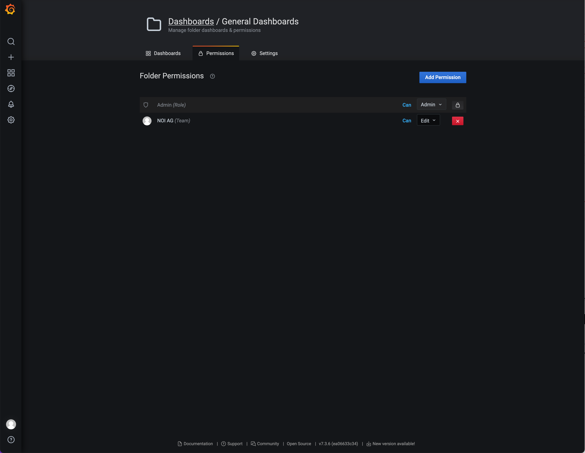

<!--
SPDX-FileCopyrightText: NOI Techpark <digital@noi.bz.it>

SPDX-License-Identifier: CC0-1.0
-->

Applications
============

If you want to configure different tools and applications to provide the authentication using the authentication server, you have to make different configurations and adjustments. In this document you can find configurations for specific tools.

## Table of contents

- [Jenkins](#jenkins)
- [Grafana](#grafana)
- [Nextcloud](#nextcloud)

## Jenkins

### Installation

First, you have to create a Keycloak client for Jenkins:



Finally, adjust the Jenkins configuration:



### Permissions

Per default, now every user with a valid Keycloak login can access the Jenkins server. However, the user has no rights and therefore, cannot do anything.

In order to provide specific users rights to the system, you have assign them to specific roles. Just add the users with their Keycloak username to the list in the section "Global roles" and add them to a specific role.



## Grafana

### Installation

First, you have to create a Keycloak client for Grafana:


Second, create the roles "Admin", "Editor" and "Viewer" for the client:



Next, create a mapper for the client:



Finally, adjust the Grafana configuration:

```yml
version: "3.4"

services:
  grafana:
    image: grafana/grafana:7.3.6
    restart: unless-stopped
    user: ${GRAFANA_UID}
    volumes:
    - ./data:/var/lib/grafana:rw
    environment:
      GF_SECURITY_DISABLE_GRAVATAR: "true"
      GF_SERVER_ROOT_URL: "https://grafana.testingmachine.eu"
      GF_USERS_ALLOW_ORG_CREATE: "false"
      GF_USERS_ALLOW_SIGN_UP: "false"

      GF_AUTH_DISABLE_LOGIN_FORM: "true"
      GF_AUTH_BASIC_ENABLED: "false"
      GF_AUTH_GENERIC_OAUTH_ENABLED: "true"
      GF_AUTH_GENERIC_OAUTH_NAME: "NOI Authentication Server"
      GF_AUTH_GENERIC_OAUTH_ALLOW_SIGN_UP: "true"
      GF_AUTH_GENERIC_OAUTH_CLIENT_ID: "grafana"
      GF_AUTH_GENERIC_OAUTH_CLIENT_SECRET: ""
      GF_AUTH_GENERIC_OAUTH_SCOPES: "openid profile email roles"
      GF_AUTH_GENERIC_OAUTH_AUTH_URL: "https://auth.opendatahub.com/auth/realms/noi/protocol/openid-connect/auth"
      GF_AUTH_GENERIC_OAUTH_TOKEN_URL: "https://auth.opendatahub.com/auth/realms/noi/protocol/openid-connect/token"
      GF_AUTH_GENERIC_OAUTH_API_URL: "https://auth.opendatahub.com/auth/realms/noi/protocol/openid-connect/userinfo"
      GF_AUTH_GENERIC_OAUTH_ROLE_ATTRIBUTE_PATH: "contains(roles[*], 'Admin') && 'Admin' || contains(roles[*], 'Editor') && 'Editor' || 'Viewer'"

      GF_SMTP_ENABLED: "true"
      GF_SMTP_HOST: ""
      GF_SMTP_USER: ""
      GF_SMTP_PASSWORD: ""
      GF_SMTP_FROM_ADDRESS: "grafana@testingmachine.eu"
      GF_SMTP_FROM_NAME: "Grafana"

      GF_INSTALL_PLUGINS: "grafana-polystat-panel,vonage-status-panel"
    ports:
    - "3000:3000"
```

### Global Permissions

Grafana has three build in global roles:

  - Admin
  - Editor
  - Viewer

Using these permissions, you can controll the actions users are allowed to perform globally. Example: with the admin role assigned, can a user access the admin area.

In order to provide a user the permissions of one of these roles, you have to assign the corresponding role in Keycloak to the user.



### Folder/Dashboard Permissions

In addition, for each folder or dashboard, you have the possibility to assign users and teams to it with one of the following permissions:

  - Admin
  - Edit
  - View

> *Note!* Make sure to remove the default roles from a newly created folder, so that users cannot see all dashboards as configured in the initial setup of a folder.



## Nextcloud
### Installation
First you have to install the Social Login plugin. In this documentation v.4.3.2 was used.

Configure like this:


Select:
- Allow users to connect social logins with their account
- Update user profile every login
- Automatically create groups if they do not exist

Add custom OAuth2

- Internal name: noi-auth
- API Base URL: https://auth.opendatahub.com/auth/realms/noi/protocol/openid-connect/
- Authorize url (can be relative to base URL): https://auth.opendatahub.com/auth/realms/noi/protocol/openid-connect/auth
- Token url (can be relative to base URL): https://auth.opendatahub.com/auth/realms/noi/protocol/openid-connect/token
- Profile url (can be relative to base URL): https://auth.opendatahub.com/auth/realms/noi/protocol/openid-connect/userinfo
- Logout URL (optional): https://auth.opendatahub.com/auth/realms/noi/protocol/openid-connect/logout
- Client Id: it.bz.opendatahub.cloud
- Client Secret: secret from keykloak
- Scope (optional): roles
- Profile Fields (optional, comma-separated): left blank
- Groups claim (optional): left blank
- Button style: free to be select
- Default group: None

### Issues
#### Provider API returned an unexpected response after login

This code change resolved the problem:

nextcloud/apps/sociallogin/lib/Provider/CustomOAuth2.php (marked with added by qbus)

        $response = $this->apiRequest($profileUrl);
        if (!isset($response->identifier) && isset($response->id)) {
            $response->identifier = $response->id;
        }
        /** added by qbus */
        if (!isset($response->identifier) && isset($response->preferred_username)) {
            $response->identifier = $response->preferred_username;
        }
        /** stop added by qbus */

        if (!isset($response->identifier) && isset($response->data->id)) {
            $response->identifier = $response->data->id;
        }
        if (!isset($response->identifier) && isset($response->user_id)) {
            $response->identifier = $response->user_id;
        }

        $data = new Data\Collection($response);

        if (!$data->exists('identifier')) {
            throw new UnexpectedApiResponseException('Provider API returned an unexpected response.');
        }

Also discussed here: https://github.com/zorn-v/nextcloud-social-login/issues/242#issuecomment-803287703

#### Internal server error on first login

Internal Server Error

The server was unable to complete your request.


This problem can be caused by a softlink in filesystem:

/var/www/nextcloud -> /var/www/nextcloud-20.0.8

After renaming /var/www/nextcloud-20.0.8 to /var/www/nextcloud everything worked fine


