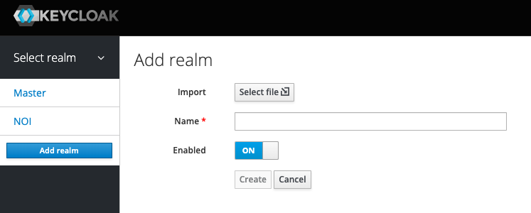
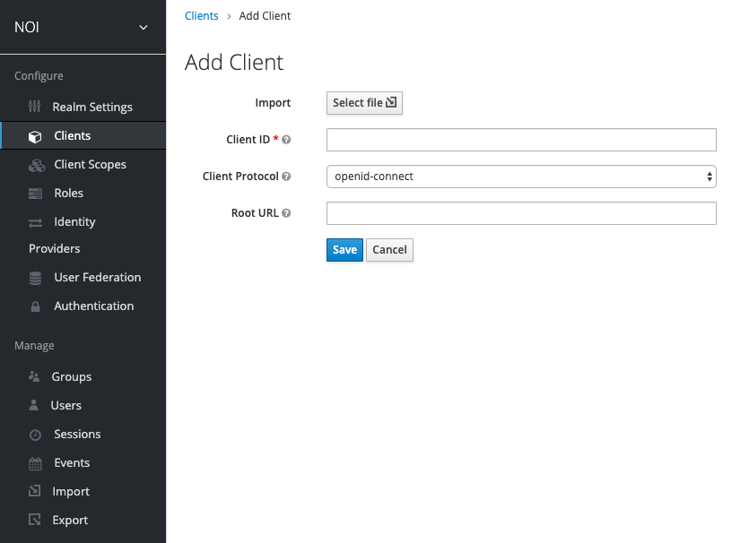
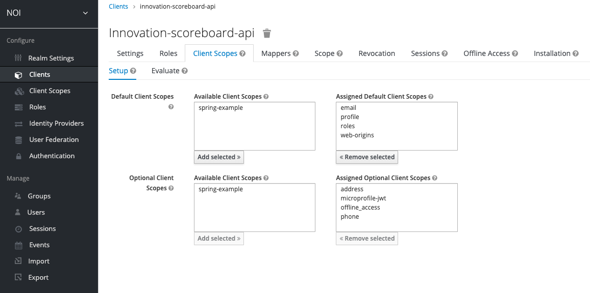
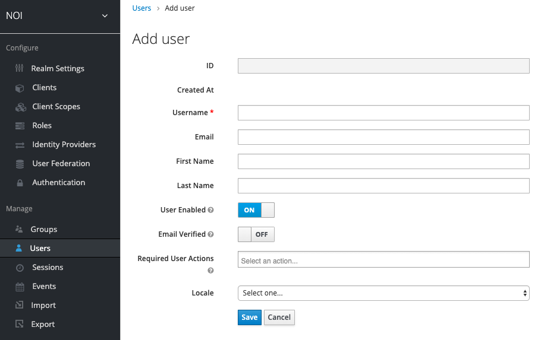

# NOI Authentication Server - Keycloak

## Table of contents

- [Realm](#realm)
- [Client registration](#client-registration)
- [Examples](#examples)
- [Users and Groups](#users-and-groups)
- [Client app examples](#client-app-examples)

# Realm

A realm is a encapsulated area with users, groups and registered clients. Keycloak allows you to configure multiple realms. Users are **not** shared between realms and can not access applications from other realms. If you want to have an account in 2 different realms, you have to create 2 accounts.

To create a new realm only a name of the realm is required.

Realm settings

- **General**: General information of the realm
- **Login**: What should be supported on the login page.
- **Email**: Email configuration for password reset emails and more.
- **Themes**: Select languages and themes that are used to render the login page.
- **Tokens**: Configuration of token and session lifetimes.

# Clients

In the clients tab you are able to list all registered clients, add new ones and modify existing ones.

The client ID is a unique identifier within the realm scope. For example it could be innovation-scoreboard-web for the web client and innovation-scoreboard-api for the backend.

The root URL can be used to later reference URLs, such as redirect URI relatively.

## Access Type

The most important field in the client settings is the **Access Type**. The access type supports following values:

- Confidential
- Public
- Bearer-only

**Confidential**: This option should be used if you create a server-side rendered web app or a backend service, where you can safely store the client secret. In order to support client credentials flow _Service accounts Enabled_ needs to be set to true.

**Public**: Use this option only if your client app is a single page application or a native mobile app that needs implicit flow support.

**Bearer-only**: Use this option if you create a resource service, that exposes endpoints that can be access with bearer tokens. If you try to initiate a authorization flow with this client ID it will not work. If thats a requirement use the confidential option.

## Roles

Define roles that are assignable to users that have access to this client application. For example admin rights on this app.
It is also possible to create roles on a realm level, but we recommend to create roles per client for better maintenance.

## Client scopes

The client scopes define which scopes can be requested by the client application.

We recommend to leave the default configuration in place and use roles for access control on resource servers. By default _email, profile, roles and web_origins_ will always be requested. Especially the roles scope is important as it mappes the roles of a user into the access token, which can than be used on the server to do role based access management.

## Scope

The scope configuration is extremely important if our client application is a public client such as a SPA or a mobile app.
As we allow the implicit flow, which is the weakest flow in terms of security, we want to limit the scope of the access token.

Set the **Full Scope Allowed** to **OFF**.

Now you can specify which resource services can be requested from this client. If we have a public web app and a resource server, than we would allow the resource server in the web apps configuration. This would prevent the access_token to be valid for other resource servers in the realm, where the user would have access to.

# Examples

## Single page application

### Settings

| Property              | Value        | Description                                                            |
| --------------------- | ------------ | ---------------------------------------------------------------------- |
| Access Type           | Public       | Support authorization without client secret needed.                    |
| Implicit Flow Enabled | True         | Enables the implicit flow grant                                        |
| Valid Redirect URIs   | Redirect URI | URI that the user-agent follows and extracts the access_token/id_token |

### Roles

We would recommend to define the roles for the backend service and don't duplicate the roles also in the web client.
The frontend can read the roles associated with the backend service in the access token.

### Scope

| Property                        | Value | Description                                                                    |
| ------------------------------- | ----- | ------------------------------------------------------------------------------ |
| Full Scope Allowed              | OFF   | Do not include all roles assigned to a user for all applications in the realm. |
| Client Roles -> **backend-service** |       | Move roles from available roles to assigned roles.                            |

## REST API backend

### Settings

| Property    | Value       | Description                            |
| ----------- | ----------- | -------------------------------------- |
| Access Type | bearer-only | No support for authorization required. |

### Roles

Add all roles that the REST API needs to manage access control. Example: admin, project_manager, ...

# Users and Groups

It is very simple to manually add a new user by filling in the following form.

It is possible to assign roles to a user or assign roles to a group and then add the user the group. For easier maintenance we recommend creating groups. For example a developer group that has certain roles per client assigned.

# Client app examples

For examples how to create a resource server, a server that uses the client credentials to request another resource server and a single page app based on VueJS please refer to the authentication-examples repository.
